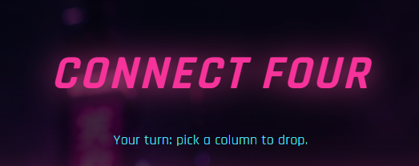

  

# 🟣 Connect Four: Cyberpunk Edition 🔴

A modern, neon-drenched take on the classic Connect Four game. This project features a beautiful frontend built with React and Tailwind CSS, powered by a Python backend that utilizes a highly advanced Adversarial Search AI to crush human opponents.

## 🌐 Live Demo

Play the game live right now! The architecture is fully decoupled and hosted in the cloud:

* **Frontend (UI):** Hosted on [Vercel](https://connectfour-ai.vercel.app/)
* **Backend (AI Engine):** Hosted on [Hugging Face Spaces](https://sxmimhd-connect4-ai.hf.space)

---
## ✨ Features

* **🧠 Advanced AI Opponent:** The backend utilizes the **Minimax algorithm with Alpha-Beta pruning** to calculate optimal moves in milliseconds.
* **🎚️ Dynamic Difficulty:** 5 distinct difficulty levels ranging from "Very Easy" (Depth 1) to "Expert" (Depth 7+), controlled by scaling the search depth and heuristic complexity.
* **🌃 Cyberpunk Aesthetic:** A fully custom, responsive UI featuring neon glows, futuristic typography, and smooth animations.
* **⚡ Decoupled Architecture:** A clean separation of concerns using a FastAPI bridge between the React frontend state and the Python game engine.

---

## 🛠️ Tech Stack

### **Frontend**
* **Framework:** React.js
* **Styling:** Tailwind CSS

### **Backend**
* **Language:** Python 3.x
* **API Framework:** FastAPI
* **Server:** Uvicorn
* **Data Validation:** Pydantic

## 🧠 How the AI Works

The AI relies on two main components to make decisions:

The Heuristic Function: Since Connect Four has trillions of possible states, the AI cannot always search to the end of the game. The heuristic function evaluates non-terminal board states by looking for "runs" of 2 or 3 discs and prioritizing center-column control.

Minimax with Alpha-Beta Pruning: The AI simulates future turns, assuming the human plays perfectly. Alpha-Beta pruning acts as an optimization layer, allowing the AI to skip evaluating branches of the decision tree that are mathematically proven to be worse than previously found paths.

## 🎮 How to Play

Launch the app and select your desired difficulty on the home screen.

Click Drop to Play.

Click any of the 7 columns to drop your purple disc.

Wait for the AI (Pink) to calculate its counter-move.

Connect four discs horizontally, vertically, or diagonally to win!

## Built for the Adversarial Search implementation assignment.
